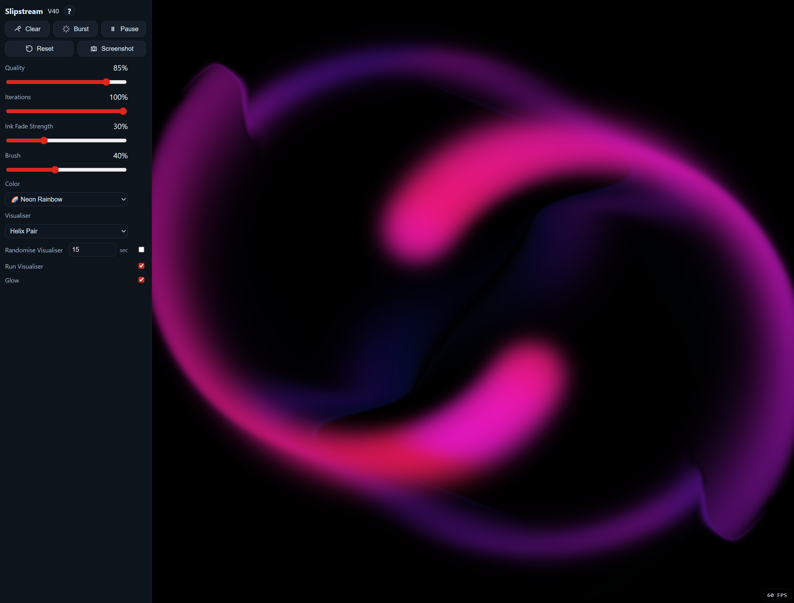
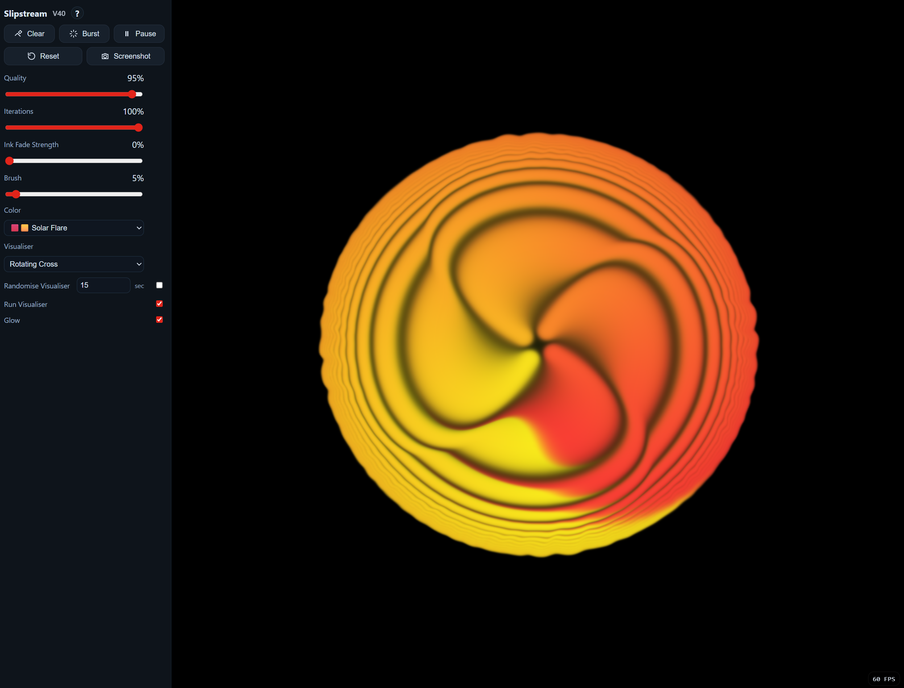

# Slipstream

Slipstream is an interactive, browser-based ink simulation you can run entirely offline from a single HTML file.  
Paint swirling, turbulent ink with your mouse, experiment with colour palettes and simulation settings, or switch on hypnotic automated visualisers that generate endless flowing patterns. Designed to be both creative and meditative, Slipstream works equally well for a few minutes of play or as a mesmerising full-screen display.

## Live Demo
[**Visit the Website**](https://swiftredvox.github.io/slipstream/)  
[**Launch Slipstream**](https://swiftredvox.github.io/slipstream/Slipstream_V40.html)  
Alternatively, download the HTML file from the repo to portably run this anywhere offline using any modern browser. 

## Screenshots

  
  
   
  
  

## Features
- Real-time GPU-accelerated ink simulation via WebGL2
- Fully self-contained single HTML file — no installs, no external assets
- Multiple colour palettes, including animated duotones
- Variety of automated visualiser patterns
- Adjustable simulation quality, stability, ink fade, and brush size
- Glow toggle and brush preview ring
- Screenshot export as PNG
- Reset to defaults
- Randomiser for visualiser mode

## How to Use
- **Paint:** Click and drag to add ink.  
- **Move ink:** Hold Shift or right-click and drag to add velocity without ink.  
- **Brush size:** Use the mouse wheel to adjust.  
- **Toggle visualiser:** Choose a mode in the dropdown or turn it off.  
- **Randomise visualiser:** Enable and set the interval (seconds).  
- **Glow:** Toggle bloom effect on/off.  
- **Clear:** Remove all ink and motion.  
- **Burst:** Add multiple random splats at once.  
- **Pause:** Freeze or resume the simulation.  
- **Reset:** Return all controls to their default values.  
- **Screenshot:** Save the current view as a PNG.

## Requirements
- A WebGL2-capable browser (latest Chrome, Edge, or Firefox recommended).
- Runs entirely offline once downloaded.

## License
This work is released under [CC0 1.0 Public Domain Dedication](https://creativecommons.org/publicdomain/zero/1.0/).  
You may copy, modify, and use it for any purpose without permission. 
Attribution is appreciated, but not required. Enjoy! 
